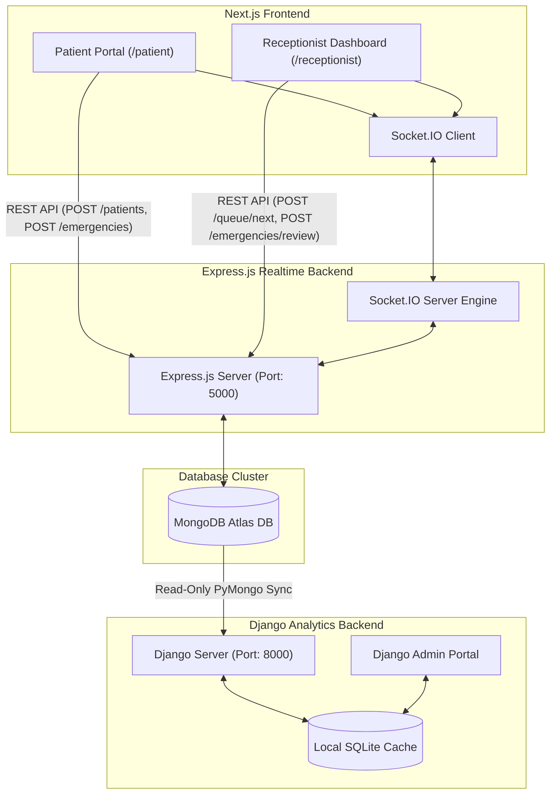

# Queue Cure '26

An enterprise-grade, real-time digital patient queue management system designed to replace legacy paper slips, keeping receptionists productive and patients informed from their own devices.

---

## 1. Project Overview & Problem Statement

### The Problem
Traditional walk-in clinics and outpatient reception desks rely heavily on manual paper-ticketing systems. This creates several operational bottlenecks:
- **Zero Visibility**: Patients are left in the dark regarding their position in the queue, causing crowded waiting rooms and anxiety.
- **Manual Overhead**: Receptionists must manually track check-in sequences, emergency elevations, and consultation metrics.
- **Inflexible Priority Handling**: Emergencies cannot be dynamically prioritized without causing confusion in the waiting line.
- **Lack of Analytics**: Medical administrators have no easy access to data regarding wait times, clinic throughput, or peak registration hours.

### The Solution
Queue Cure '26 bridges these gaps by providing:
1. **Patient Portal**: An interactive interface allowing patients to register, view the live token queue, request emergency promotion, and check estimated wait times.
2. **Receptionist Portal**: A high-efficiency console to view active queues, review emergency requests, call next patients, and reset the queue.
3. **Socket.IO Real-Time Engine**: Instant synchronization of queue updates across all connected clients.
4. **Django Analytics**: A read-only administration dashboard that syncs with MongoDB to compile wait times, peak hours, and clinic throughput metrics.

---

## 2. Features
- **Real-Time Synchronisation**: Changes made by receptionists are instantly pushed to all patients.
- **Automated Queue Management**: First-In, First-Out (FIFO) queue order with atomic status transitions.
- **Emergency Priority Workflow**: Request promotion with reason, receptionist approval, and dynamic queue re-sorting.
- **Double-Click Protection**: Atomic database updates ensure no double-tokens are processed.
- **Interactive Analytics Dashboard**: Beautiful charts showing clinic peak registration hours, throughput, and emergency approval rates.
- **Data Export**: Export daily, weekly, and monthly reports to CSV or JSON formats.

---

## 3. Tech Stack

### Frontend
* **Next.js** (v16.2)
* **React** (v19)
* **TypeScript** (v5)
* **Tailwind CSS** (v4)
* **Socket.IO Client**

### Backend
* **Express.js** (Node.js)
* **Socket.IO** (Real-time bidirectional event engine)

### Database
* **MongoDB** (Atlas hosted database instance)
* **Mongoose** (Object Data Modeling)

### Analytics
* **Django** (Python 3)
* **SQLite** (Local cache database)
* **PyMongo** (Read-only database client)
* **Chart.js** (Frontend metrics charts)

---

## 4. Architecture Diagram

The system operates across three main layers: a Next.js frontend, an Express.js API & Socket.IO real-time sync layer, and an isolated Django Analytics database cache.



---

## 5. Setup Instructions

### Prerequisites
- Node.js (v18+)
- Python (v3.10+)
- MongoDB Atlas cluster URL (or a running local MongoDB instance)

### Step 1: Configure Environment Variables

Create `server/.env` inside the `server/` directory:
```ini
PORT=5000
MONGODB_URI=mongodb+srv://<username>:<password>@cluster0.mongodb.net/queue-cure
```

Create `.env.local` inside the workspace root:
```ini
NEXT_PUBLIC_SOCKET_URL=http://localhost:5000
```

### Step 2: Initialize Express Backend
```bash
cd server
npm install
npm run build
npm start
```

### Step 3: Initialize Next.js Frontend
In a separate terminal:
```bash
# In workspace root
npm install
npm run dev
```
Access the application at [http://localhost:3000](http://localhost:3000).

### Step 4: Initialize Django Analytics Backend
In another terminal:
```bash
cd django_backend
python -m venv venv
# Windows:
.\venv\Scripts\activate
# macOS/Linux:
source venv/bin/activate

pip install -r requirements.txt
python manage.py migrate
# Seed superuser (Credentials: admin / admin)
python manage.py shell -c "from django.contrib.auth.models import User; User.objects.create_superuser('admin', 'admin@example.com', 'admin')"
# Fetch initial database cache
python manage.py sync_mongo
python manage.py runserver
```
Access the analytics dashboard at [http://localhost:8000/analytics/dashboard/](http://localhost:8000/analytics/dashboard/).
Access the Django Admin console at [http://localhost:8000/admin/](http://localhost:8000/admin/).

---

## 6. Deployment Instructions

### MongoDB Deployment Guide (Atlas Setup)
1. Register for a free account at [MongoDB Atlas](https://www.mongodb.com/cloud/atlas).
2. Create a new Free Shared Database Cluster (M0).
3. Under **Database Access**, create a user with read/write privileges (`Read and Write to any database`).
4. Under **Network Access**, whitelist `0.0.0.0/0` (allow connections from all deployment servers).
5. In your Cluster Overview, click **Connect** → **Drivers** and copy your MongoDB connection URI (e.g., `mongodb+srv://<username>:<password>@cluster0.mongodb.net/queue-cure`).
6. Save this connection string as the `MONGODB_URI` environment variable for your Express and Django servers.

### Express Deployment Guide (Render / Railway)
1. Link your repository to [Render](https://render.com) or [Railway](https://railway.app).
2. Deploy a new **Web Service** targeting the `/server` directory.
3. Configure the following build & run options:
   - **Build Command**: `npm install && npm run build`
   - **Start Command**: `npm start`
4. Set the following environment variables:
   - `PORT`: `5000` (or leave to platform default)
   - `MONGODB_URI`: *Your MongoDB Atlas connection string*

### Frontend Deployment Guide (Vercel)
1. Link your repository to [Vercel](https://vercel.com).
2. Set the framework preset to **Next.js**.
3. Configure the following environment variable:
   - `NEXT_PUBLIC_SOCKET_URL`: *The URL of your deployed Express service* (e.g., `https://queue-cure-api.onrender.com`)
4. Click **Deploy**.

### Django Deployment Guide (Render / Railway)
1. Link your repository to Render or Railway.
2. Deploy a new **Web Service** targeting the `/django_backend` directory.
3. Configure the build & run options:
   - **Build Command**: `pip install -r requirements.txt && python manage.py migrate && python manage.py collectstatic --no-input`
   - **Start Command**: `gunicorn django_backend.wsgi`
4. Set the following environment variables:
   - `MONGODB_URI`: *Your MongoDB Atlas connection string*
   - `DJANGO_SETTINGS_MODULE`: `django_backend.settings`
   - `SECRET_KEY`: *A secure random string*
   - `DEBUG`: `False`

---

## 7. Screenshots Section

Below is a schematic mapping of the frontend layout and receptionist workflows:

```text
+------------------------------------+      +------------------------------------+
|           Patient Portal           |      |        Receptionist Console        |
|                                    |      |                                    |
| [Register Name Input Box]          |      | Active Serving Token: A002         |
| Active Serving Token: A002         |      | Avg Consultation Time: [ 5 ] mins  |
| Your Token: A005                   |      |                                    |
| Waiting Patients: 2                |      | Patient List:                      |
| Est. Wait Time: 10 mins            |      | A003 - John Doe     [Call Next]    |
|                                    |      | A004 - Sarah Smith  [Call Next]    |
| [Submit Emergency Priority Request]|      |                                    |
|   - Select Token & Enter Reason    |      | Emergency Request Inbox:           |
|                                    |      | A004 - "Severe Pain" [Approve/Deny]|
+------------------------------------+      +------------------------------------+
```

---

## 8. Future Improvements
- **JWT Authorization**: Implement secure JSON Web Tokens for receptionists.
- **SMS/WhatsApp Notifications**: Connect Twilio APIs to alert patients when their turn is near.
- **Multi-Queue Routing**: Support multiple consulting rooms and diagnostic departments.
